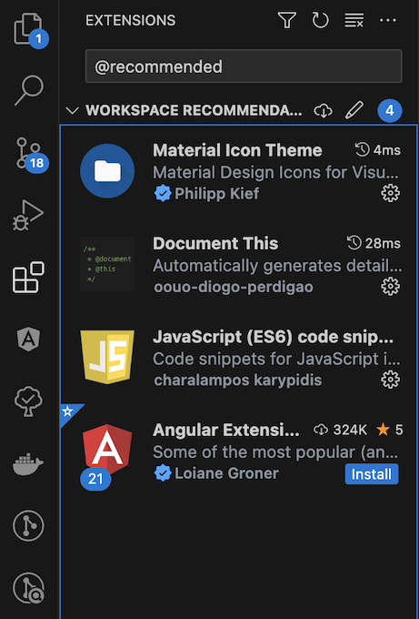

# angular19-sample-app
## 一、專案說明

本專案是使用 [Angular CLI](https://github.com/angular/angular-cli) 版本 19.2.11 建立
 搭配`Google`的[gts](https://github.com/google/gts)，對專案的程式碼和排版進行統一的規範和檢核。

[](https://github.com/google/gts)

### 特點

1. `Angular19`版本並使用`Standalone`架構
2. 使用程式碼、提交訊息檢核和排版工具(`ESLint、Commitizen、Prettier`)
3. 使用 [Google Code Style](https://github.com/google/gts)
4. 搭配使用`VScode Extension`在檔案儲存時自動排版和Lint
5. Commit時會進行程式語法檢核強制排版以確保每次提交都有一致性。

## 二、專案環境和套件

### 環境設置

| 檔案                                         | 版本                 |
| -------------------------------------------- | -------------------- |
| [Node.js](https://nodejs.org/zh-tw/download) | ^20.19.0 |
| [git](https://git-scm.com/downloads)         | 不限                 |
| [Angular cli](https://angular.io/cli)        | 19版                 |

### VScode Extension安裝



請在`EXTENSIONS`內搜尋`@recommended`(如上圖)，會看到推薦安裝的Extensions，請全部安裝下來。

## 三、專案啟動

輸入以下指令，進行套件安裝

```bash
npm install
```

待安裝完套件後輸入以下指令來啟動專案

```bash
ng serve
```

## 四、專案Commit

請輸入以下指令，以便呼叫出Commitizen工具協助進行Commit訊息的撰寫

```bash
npm run commit
```

## 五、指令

- `ng serve` - 啟動開發服務器。
- `ng build` - 產生打包。
- `npm test` - 運行單元測試。
- `npm run lint` - 執行程式碼檢查。
- `npm run commit`- 使用 Commitizen 提交變更。

## 六、專案資料夾結構

表示當前專案沒有該檔案，在此列出是為了顯示結構，可以依照需求自行新增。
```text

- 📂 angular19-sample-app
  - 📂 e2e
  - 📂 node_modules
  - 📂 src
      - 📂 app
          - 📂 core （共用工具模組）
               - 📂 constants：共用常數定義，避免 magic number 或字串
               - 📂 enums：列舉定義，統一管理選項類型
               - 📂 guards：路由守衛，控制路由存取權限
               - 📂 interceptors：HTTP 攔截器，處理請求與回應邏輯
               - 📂 models：通用資料模型，供整體應用共用
               - 📂 services：通用服務，例如本地儲存或 API 共用邏輯
               - 📂 utils：工具方法（如 common.utils.ts 提供共用邏輯）
               - 📂 validators：自訂驗證器，表單驗證邏輯集中管理
          - 📂 features（功能模組）
               - 📂 feature-a
                    - 📄 feature-a.component.html/scss/ts：該功能畫面元件
                    - 📂 models：此功能專屬的資料模型定義
          - 📂 shared（共用模組與元件）
               - 📂 components：可複用元件
               - 📂 directives：自訂指令
               - 📂 layout：畫面排版元件（如 header, footer）
               - 📂 pipes：自訂資料格式轉換器
          - 📄 app.component.*：應用主元件
          - 📄 app.module.ts：根模組（若使用 standalone 可移除）
          - 📄 app.routing-module.ts：路由設定（若使用 standalone 可移除）
      - 📂 assets（靜態資源）
          - 📂 data：假資料或 JSON 檔
          - 📂 icons：SVG 或圖示集
          - 📂 images：圖片資源
          - 📂 scripts：外部 JS 程式碼
      - 📂 environments：環境變數設定
          - 📄 environment.ts：開發環境
          - 📄 environment.prod.ts：正式環境
      - 📂 styles（全域樣式）
          - 📄 _custom.scss：第三方樣式覆寫
          - 📄 styles.scss：全域樣式進入點
      - 📄 index.html：主 HTML 模板
      - 📄 main.ts：應用程式進入點
      - 📄 polyfills.ts：瀏覽器相容補丁
  - 📄 .gitignore
  - 📄 angular.json
  - 📄 package.json
  - 📄 tsconfig.json
  - 📄 README.md
```

建議開發者依照此結構進行模組與元件規劃，可提升專案可維護性與協作效率。

## 七、參考連結

- [Google-gts](https://github.com/google/gts)
- [Commitizen](https://github.com/commitizen/cz-cli)
- [Commitlint](https://github.com/conventional-changelog/commitlint)
- [lint-staged](https://github.com/lint-staged/lint-staged)
- [husky](https://typicode.github.io/husky/)